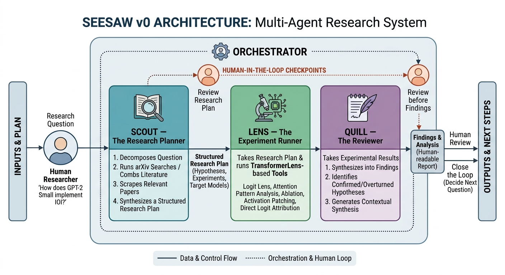

# Seesaw

A multi-agent framework for automated mechanistic interpretability research.



---

## Overview

Seesaw automates the hypothesis-experiment-critique loop in mechanistic interpretability.
A human researcher provides a research question. Three agents handle the rest.

```
Scout → [Research Plan] → Lens → [ExperimentBundle] → Quill → [CritiqueReport]
```

Human-in-the-loop checkpoints sit between agents so you stay in control of what runs.

---

## Agents

### Scout — The Research Planner
Takes a research question, searches arXiv and the web, and produces a structured Research Plan
specifying hypotheses, target models, and experiments to run.

**Tools:** `search_arxiv`, `search_arxiv_web`, `search_web`, `scrape_url`, `save_research_plan`  
**Stack:** LangGraph ReAct, Claude, Firecrawl

### Lens — The Experiment Runner
Executes mechanistic interpretability experiments from the Research Plan using TransformerLens,
then generates LLM interpretations of each result.

| Tool | Answers |
|---|---|
| `logit_lens` | Where does the model decide? |
| `attention_pattern` | What does each head attend to? |
| `direct_logit_attribution` | Which components write the final prediction? |
| `ablation` | Is this component causally necessary? |
| `activation_patching` | Which layer and position carries the critical signal? |

**Stack:** LangGraph StateGraph, Claude, TransformerLens

### Quill — The Reviewer
Reviews the ExperimentBundle as a scientific peer reviewer. Flags methodological issues,
unsupported conclusions, and missing experiments. Outputs structured follow-up specs
that Lens can execute directly.

**Stack:** LangGraph StateGraph, Claude Opus

---

## Motivation

Most mechanistic interpretability work is done manually — identify a circuit, ablate it,
write it up. Seesaw is an experiment in automating the research loop, with the goal of
accelerating exploratory safety research on small models.

---

## Status

Active development. Agents are functional as standalone modules.
Orchestrator wiring and MCP server implementations are in progress.

---

## License

Apache 2.0